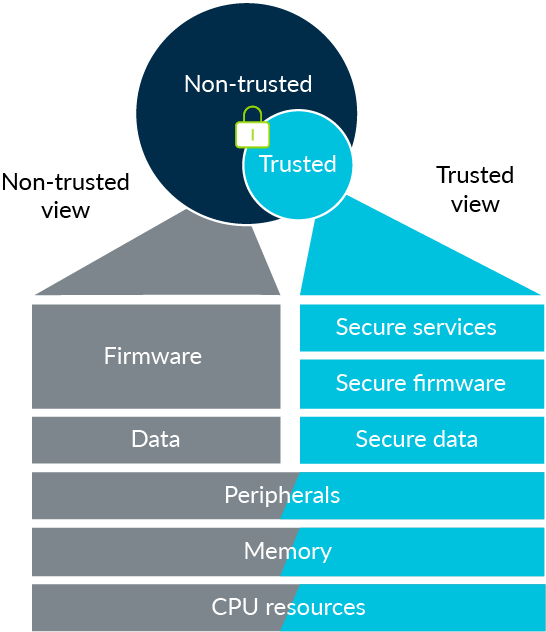

# <ins>Trust_zone_ARM </ins>

Renseignement à propos des Trust zone sur les ARM

#### Sources

``official site`` [armDeveloper](https://developer.arm.com/ip-products/security-ip/trustzone)

``Article`` [About trustZone](https://www.microcontrollertips.com/embedded-security-brief-arm-trustzone-explained/)

``Article`` [Introduction to Trusted Execution Environment](https://blog.quarkslab.com/introduction-to-trusted-execution-environment-arms-trustzone.html)

``Video`` [ARM TrustZone for dummies](https://www.youtube.com/watch?v=ecBByjwny3s)

``Video`` [Secure partition managers](https://www.youtube.com/watch?v=72OtwkavOvM)

``Image`` [TrustZone.png](https://developer.arm.com/ip-products/security-ip/trustzone/trustzone-for-cortex-m)

#### Acronyms

``DRM`` : Digital Rights Management

``REE`` : Rich Execution environments

``TEE`` : Trusted Execution Environment

``TZASC`` : TrustZone Address Space Controler

``TZPC`` : TrustZone Protection Controler

``TZMA`` : TrustZone Memory Adapter

## About trustZone

Arm TrustZone is an embedded security technology that **starts at the hardware level** by creating two environments that can run simultaneously on a single core: a **secure world** and a **not-as-secure world** (non-secure world)

> Isolation hardware qui permet de faire tourner un Linux d'un coté et un OS minimal, spécialisé dans la sécurité qui va faire tourner des applications de sécurité (verification et update de firmware, signature, chiffrement, alertes ...)

TrustZone is based on the principle of **least privilege**, which means that system modules like drivers and applications do not have access to a resource unless necessary.

> **Rappel du principe de ``last privilege``**:
Service et éxécutable doivent être configurés et intégrés afin d'accorder le strict nécessaire en privilège .
>> **Les conséquences sont donc limitées aux privilèges octroyés.**

TrustZone includes a **Secure Boot Sequence** verifies secure boot images. Images can be **cryptographically** authenticated using public and private keys. Once the system has finished booting up, the two OSes can communicate via a monitor kernel mode, which behaves much like a context switch.

***Although no device can be made entirely hack-proof, TrustZone makes it much more difficult.***

## About ARM

Aussi pour ARM, il faut bien distinguer:
* Cortex-A  Micro-Processeur ==> *destinée aux smartphones et tablettes tactiles*
*	Cortex-M Micro-Controler ==> *dédiée à l'embarqué*
*	Cortex-R RealTime ==> *dédiée au temps-réel*

Selon [Wikipédia](https://fr.wikipedia.org/wiki/Architecture_ARM) :

> **ARM Cortex-A** est une famille de processeurs RISC 32 bits d'architecture ARM, développée par ARM Ltd qui met en œuvre le jeu d'instructions ARMv7-A (le A est pour Cortex-A). Elle est destinée au marché des smartphones et tablettes tactiles

> **ARM Cortex-M** est une famille de processeur RISC 32-bits d'architecture ARM servant à la fois de microprocesseur et de microcontrôleur à destination de l'embarqué.

> **L'ARM Cortex-R** est un microprocesseur temps réel, conçu par ARM, prévu pour être implémenté dans des SoC d'architecture ARM.

On retrouve les "-A" "-M" dans beaucoup de denominations, par exemple [Trusted Firmware-M (TF-M)  vs.  TF-A pour les Cortex-A.](https://developer.arm.com/ip-products/security-ip/trustzone)

Feature/Architecture | TrustZone for Armv8-A | TrustZone for Armv8-M
-------------------- | --------------------- | ---------------------
Additional security states | SEL0 - Trusted Apps SEL1 - Trusted OS EL3 - Trusted Boot and Firmware (Armv8-A) |	Secure thread - Trusted code/data Secure handler - Trusted device drivers, RTOS, Library managers...
Secure interrupts |	Yes |	Yes (Fast)
State transition (Boundary crossing) | Software transition | Hardware transition (Fast)
Memory management |	Virtual memory MMU with secure attributes |	Secure Attribution Unit (SAU) and MPU memory partitions
System interconnect security | Yes | Yes
Secure code, data and memory | Yes | Yes
Trusted boot | Yes | Yes
Software | Trusted Firmware-A (and third-party TEEs) | Arm Keil MDK, CMSIS, Arm Mbed OS, Trusted Firmware-M and third-party software

## About architecture:

